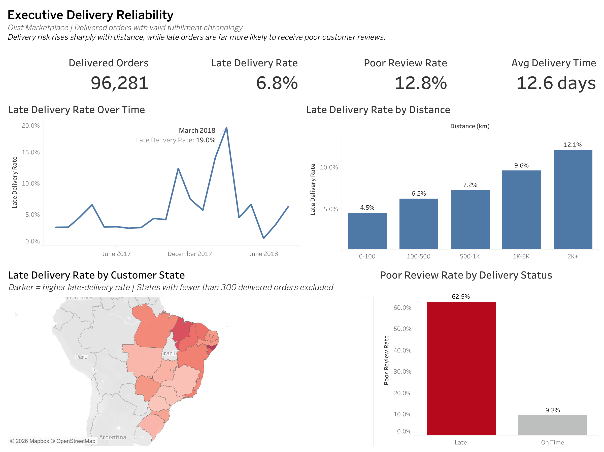
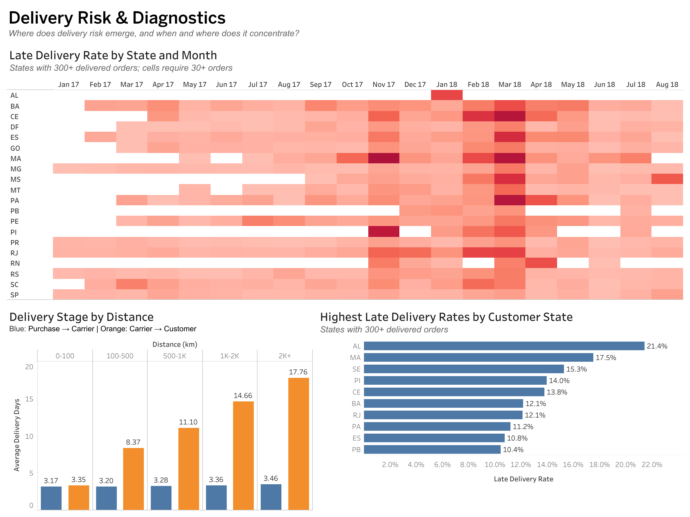
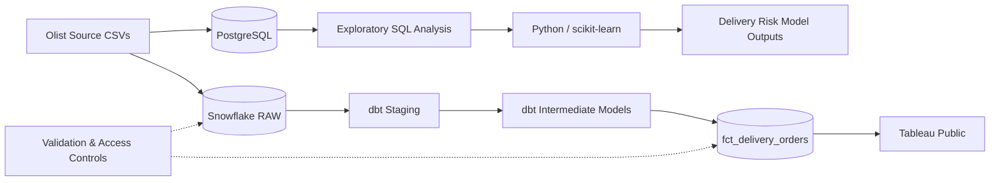

# Olist Delivery Reliability Analytics

An end-to-end analytics project examining how delivery performance, geography, fulfillment stages, and delivery-date promises affect customer experience in the Olist Brazilian e-commerce marketplace.

The project combines **PostgreSQL, Snowflake, dbt, Python/scikit-learn, and Tableau** to move from raw marketplace data through transformation, exploratory analysis, predictive modeling, and executive-facing visualization.

## Business Question

**How should Olist improve delivery reliability and delivery-date promises to reduce poor customer experiences?**

## Executive Summary

Analysis of 96,281 delivered orders with valid fulfillment chronology found that delivery risk is concentrated in specific geographies, time periods, and the carrier portion of the fulfillment process.

- **6.8% of delivered orders arrived late.**
- Among orders with reviews, **62.5% of late orders received a poor review**, compared with **9.3% of on-time orders**. This is a descriptive relationship and does not by itself establish causality.
- Late-delivery rates increased from **4.5% for orders traveling under 100 km** to **12.1% for orders traveling 2,000+ km**.
- The distance penalty emerged primarily **after carrier handoff**. Average purchase-to-carrier time remained relatively stable at roughly 3.2–3.5 days across distance bands, while average carrier-to-customer time increased from **3.35 days to 17.76 days**.
- Olist generally provided longer delivery promises for longer-distance orders, but long-distance deliveries still showed greater tail risk, suggesting that variability—not simply average promised time—was an important reliability challenge.
- A pre-delivery logistic regression model achieved **0.777 ROC AUC** on a chronological holdout period. The highest-risk 20% of test orders contained approximately **60% of observed severe delivery failures**, demonstrating the potential value of targeted monitoring rather than treating every order equally.


## Tableau Dashboards

The analysis is presented through two Tableau dashboards designed for different levels of decision-making.

### Executive Delivery Reliability

The executive view summarizes overall delivery performance and customer experience, with emphasis on late-delivery trends, geographic variation, distance, and review outcomes.

[View the interactive Tableau Public workbook](https://public.tableau.com/app/profile/stephen.holland1611/viz/OlistDeliveryReliabilityAnalytics/ExecutiveDeliveryReliability)



### Delivery Risk & Diagnostics

The diagnostic view explores where delivery risk emerges operationally, including state-by-month patterns, fulfillment-stage timing, and geographic concentrations of late deliveries.

[View the interactive Tableau Public workbook](https://public.tableau.com/app/profile/stephen.holland1611/viz/OlistDeliveryReliabilityAnalytics/ExecutiveDeliveryReliability)




## Project Architecture

The project uses two complementary analytical paths from the same Olist source data:

1. **PostgreSQL + Python** for exploratory analysis, hypothesis development, feature engineering, and predictive modeling.
2. **Snowflake + dbt + Tableau** for a production-style analytics pipeline, tested transformation layer, curated delivery mart, and executive reporting.




## Methodology

### Delivery Population

The primary analytical population contains **96,281 delivered orders with valid fulfillment chronology**. Orders with missing delivery timestamps or invalid event sequencing were excluded from delivery-duration analysis.

### Late Delivery

An order is classified as late when its **actual delivery calendar date occurs after the estimated delivery calendar date**.

Using calendar dates rather than full timestamps avoids classifying an order as late simply because it arrived later in the day than the timestamp attached to the estimated delivery date.

### Seller-to-Customer Distance

Customer and seller locations were represented using cleaned latitude and longitude coordinates at the ZIP-prefix level.

- Implausible Brazilian coordinates were removed.
- Multiple geolocation observations within a ZIP prefix were consolidated using median coordinates.
- Great-circle distance was calculated between seller and customer locations.
- Distance analysis is limited to orders where a meaningful seller-to-customer distance could be established.

### Fulfillment Stages

Total delivery time was separated into two operational stages:

- **Purchase → Carrier:** time before the order was handed to the logistics carrier.
- **Carrier → Customer:** time between carrier handoff and customer delivery.

This decomposition was used to determine whether increasing distance affected seller-side processing, transportation, or both.

### Delivery Tail Risk

Average delivery time alone can hide operational instability. The analysis therefore also examined the upper tail of carrier transit time, including the **95th percentile**, to identify unusually long deliveries and geographic or calendar concentrations of severe delays.

### Customer Experience

Poor customer experience is represented by review scores of **1 or 2 stars**.

Review results are treated as descriptive associations rather than causal estimates. Differences in review rates between late and on-time orders may also reflect other characteristics of the order or customer experience.

### Predictive Modeling

A logistic regression model was developed in Python/scikit-learn to test whether severe delivery risk could be identified before the final delivery outcome was known.

The model focused specifically on **long-distance orders traveling more than 1,000 km**, rather than the full delivered-order population. Eligible orders were delivered, single-seller orders with valid seller and customer geolocation, valid carrier-handoff and customer-delivery timestamps, and purchase dates from January 2017 through August 2018.

The modeling process used:

- **15 pre-delivery predictors**
- categorical encoding within a scikit-learn pipeline
- a **chronological train/test split**, with orders from March 1, 2018 onward held out for testing
- a severe-failure target based on unusually long **carrier-to-customer transit time**

To avoid using future information when defining the target, the severe-failure threshold was calculated exclusively from the training population. The training-period 95th-percentile carrier-transit threshold was approximately **34.84 days**.

Model performance was evaluated using both ROC AUC and Average Precision because severe delivery failures were relatively uncommon. Risk concentration by score decile was also evaluated to determine whether the model could support targeted operational intervention.

The model is intended as a **risk-prioritization tool**, not as evidence that any individual feature causes delivery failure.


## Key Findings

### 1. Delivery reliability deteriorates as distance increases

Late-delivery rates rose steadily across seller-to-customer distance bands:

| Distance | Delivered Orders | Late Delivery Rate |
| --- | ---: | ---: |
| 0–100 km | 17,675 | 4.51% |
| 100–500 km | 36,406 | 6.19% |
| 500–1,000 km | 25,325 | 7.22% |
| 1,000–2,000 km | 9,591 | 9.61% |
| 2,000+ km | 5,561 | 12.10% |

Orders traveling 2,000+ km were therefore late at more than twice the rate of orders traveling under 100 km.

### 2. The distance penalty appears primarily after carrier handoff

Seller-side processing time changed relatively little as distance increased, while carrier transit time increased substantially.

| Distance | Purchase → Carrier | Carrier → Customer |
| --- | ---: | ---: |
| 0–100 km | 3.17 days | 3.35 days |
| 100–500 km | 3.20 days | 8.37 days |
| 500–1,000 km | 3.28 days | 11.10 days |
| 1,000–2,000 km | 3.36 days | 14.66 days |
| 2,000+ km | 3.46 days | 17.76 days |

This suggests that the operational challenge associated with long-distance delivery is concentrated much more heavily in transportation after carrier handoff than in pre-carrier order processing.

### 3. Longer delivery promises do not fully eliminate long-distance tail risk

Olist already gave customers substantially more promised time for longer-distance orders.

Average purchase-to-estimated-delivery time increased from approximately **15.9 days for orders under 100 km** to **33.8 days for orders traveling 2,000+ km**.

Despite this additional buffer, the long-distance group still had a **12.1% late-delivery rate**, and its upper-tail performance was substantially worse.

The issue is therefore not simply that long-distance orders were given the same promise as short-distance orders. Greater variability and severe-delay risk remained even after promised delivery windows were extended.

### 4. Delivery failures are concentrated geographically and over time

Delivery performance varied meaningfully by destination state and month rather than behaving as a uniform national problem.

Among states with at least 300 delivered orders, several had substantially higher late-delivery rates than the overall 6.8% rate. The analysis also identified a pronounced deterioration in **March 2018**, when the overall late-delivery rate reached approximately **19%**.

Some state-and-month combinations experienced substantially sharper deterioration, indicating that national averages can obscure localized operational disruptions.

### 5. Late delivery is strongly associated with poor customer reviews

Among reviewed delivered orders:

- **62.5% of late orders received a 1- or 2-star review**
- **9.3% of on-time orders received a 1- or 2-star review**

This large descriptive difference makes delivery reliability an important customer-experience metric, although the analysis does not establish that lateness alone caused the difference in review outcomes.

### 6. Delivery risk can be concentrated before the outcome is known

The logistic regression model achieved:

- **ROC AUC: 0.777**
- **Average Precision: 0.144**, compared with a **4.35% severe-failure base rate**
- approximately **40% of severe failures captured in the highest-risk 10% of test orders**
- approximately **60% captured in the highest-risk 20%**

Calendar and geographic variables were among the strongest predictive signals. Because several of these features are correlated and delivery conditions changed over time, feature importance should be interpreted as predictive rather than causal.

The practical implication is that operational teams would not necessarily need to intervene on every order. A risk-scoring approach could help concentrate monitoring on a much smaller subset of orders containing a disproportionate share of severe failures.


## Business Recommendations

### Prioritize high-risk orders for proactive monitoring

Use pre-delivery risk scoring to identify orders that warrant closer operational attention rather than applying the same monitoring intensity to every shipment.

Because the highest-risk 20% of test orders contained approximately 60% of severe delivery failures, a targeted workflow could concentrate exception management on a much smaller portion of the order population.

Potential actions include earlier shipment-status review, carrier follow-up, customer communication, or escalation when an order begins deviating from its expected fulfillment path.

### Manage delivery promises at the geography-and-time level

Distance alone should not determine promised delivery dates.

The analysis shows meaningful differences by destination geography, lane, and calendar period, suggesting that delivery promises could incorporate recent performance for specific geographic combinations rather than relying primarily on broad average transit expectations.

Promise adjustments should be monitored carefully so that improved on-time performance does not come simply from making delivery estimates unnecessarily conservative.

### Focus operational improvement on carrier-stage performance

Long-distance orders showed only modest increases in purchase-to-carrier time but much larger increases in carrier-to-customer transit time.

Operational improvement efforts should therefore emphasize post-handoff performance, including carrier and lane-level service monitoring, recurring delay patterns, and escalation thresholds for shipments that begin moving outside expected transit ranges.

### Build exception management around tail risk, not only averages

Average delivery performance can appear acceptable while a relatively small group of orders experiences extreme delays.

Operational reporting should therefore include measures such as late-delivery rate, upper-percentile transit time, severe-delay incidence, and geographic/calendar concentrations of failures alongside average delivery time.

This would make emerging reliability problems more visible before they are diluted within national averages.


## Limitations

- **Observational data:** Relationships between delivery performance, geography, and review outcomes are descriptive. The analysis does not establish causal effects.

- **Limited carrier detail:** The dataset identifies shipment timing but does not include detailed carrier identifiers, routes, service levels, or operational scan events. Post-handoff delays can therefore be localized analytically but not attributed to a specific carrier process.

- **Approximate distance:** Seller-to-customer distance is calculated from ZIP-prefix geolocation centroids rather than exact shipment routes. It represents geographic separation, not actual transportation mileage.

- **Incomplete source update history:** The Olist source does not provide a reliable source-system `updated_at` or ingestion timestamp. The dbt incremental strategy therefore uses a 60-day lookback based on observed order and review lifecycle lags, while very late historical corrections may still require a full refresh.

- **Historical marketplace data:** The dataset represents a historical period of Olist marketplace activity. Delivery patterns, carrier networks, customer expectations, and operating conditions may differ from current conditions.

- **Predictive model stability:** Geographic and calendar variables were among the strongest predictive features, and some are correlated with one another. Model performance and feature importance may therefore shift across time periods or changing operating environments.

- **Review coverage:** Not every delivered order received a review. Poor-review rates are calculated among reviewed orders and may not represent the experience of customers who did not submit feedback.

- **Tableau Public data delivery:** The published Tableau workbook uses an exported CSV from the curated Snowflake mart rather than a persistent live warehouse connection. The dashboard therefore reflects the dataset at the time of export.


## Repository Structure

```text
olist-commerce-analytics/
├── dbt/
│   └── olist_analytics/
│       ├── dbt_project.yml
│       └── models/
│           ├── staging/
│           ├── intermediate/
│           └── marts/
│
├── docs/
│   └── images/
│       ├── delivery_risk_diagnostics.png
│       └── executive_delivery_reliability.png
│
├── outputs/
│   └── model/
│       └── curated model evaluation outputs
│
├── python/
│   ├── 01_test_database_connection.py
│   ├── 02_inspect_model_dataset.py
│   └── 03_prepare_model_data.py
│
├── samples/
│   └── sample extracts from the Olist source datasets
│
├── sql/
│   ├── analysis/
│   │   └── exploratory and business-focused PostgreSQL analysis
│   ├── postgres/
│   │   └── raw schema creation and source profiling
│   └── snowflake/
│       ├── 00_infrastructure.sql
│       ├── 01_dbt_access_setup.sql
│       ├── 02_raw_validation.sql
│       ├── 03_dbt_validation.sql
│       ├── 04_incremental_strategy_analysis.sql
│       ├── 05_tableau_access_setup.sql
│       ├── 06_tableau_export.sql
│       └── 07_tableau_validation.sql
│
├── compose.yaml
├── .gitignore
└── README.md
```
The repository intentionally excludes raw source data, credentials, local environment files, generated dbt artifacts, and learning-only scripts.


## Data Source and Reproducibility

### Data Source

This project uses the [Brazilian E-Commerce Public Dataset by Olist](https://www.kaggle.com/olistbr/brazilian-ecommerce), published on Kaggle.

The source contains nine CSV datasets covering marketplace orders, customers, sellers, order items, products, category translations, payments, reviews, and Brazilian ZIP-prefix geolocation data.

Raw source files are intentionally excluded from this repository. Small sample extracts are included in `samples/` to illustrate source structure without duplicating the full dataset.

### Reproducing the Project

The repository documents the analytical workflow, but reproducing the complete environment requires local configuration for PostgreSQL, Snowflake, dbt, and Python.

At a high level:

1. Obtain the nine Olist source CSV files from Kaggle.
2. Load the source data into PostgreSQL using the scripts in `sql/postgres/` for exploratory analysis.
3. Run the business-focused SQL analyses in `sql/analysis/`.
4. Use `python/03_prepare_model_data.py` to prepare the modeling dataset and evaluate delivery-risk performance.
5. Load the same raw source datasets into `OLIST_ANALYTICS.RAW` in Snowflake.
6. Configure a local dbt profile outside the repository and run the project in `dbt/olist_analytics/`.
7. Validate the Snowflake/dbt pipeline using the scripts in `sql/snowflake/`.
8. Export `FCT_DELIVERY_ORDERS` for use in the published Tableau Public workbook.

### Configuration and Security

Credentials and machine-specific configuration are intentionally excluded from source control.

The repository does not contain:

- database passwords
- Snowflake private keys or passphrases
- `.env` files
- local dbt `profiles.yml`
- raw source CSV files
- Python virtual environments
- generated dbt `target/` or log files

Environment variables and external configuration are used where credentials are required.


## Skills Demonstrated

This project demonstrates an end-to-end analytics workflow spanning business problem definition, data engineering, analysis, predictive modeling, and executive communication.

- **SQL analytics:** source profiling, multi-table transformations, geographic analysis, fulfillment-stage decomposition, cohort analysis, and validation
- **Snowflake:** warehouse/database/schema setup, role-based access, raw-data ingestion, validation, and analytical data marts
- **dbt:** sources, staging models, intermediate transformations, testing, documentation, lineage, and incremental modeling
- **Python / scikit-learn:** data preparation, feature engineering, chronological model validation, classification metrics, and risk concentration analysis
- **Tableau:** KPI design, geographic analysis, time-series diagnostics, executive dashboarding, and published interactive reporting
- **Analytics engineering:** separation of raw, transformed, and consumption layers; reproducible validation; controlled access; and documented assumptions
- **Business analysis:** translating technical findings into operational recommendations while distinguishing descriptive evidence from causal conclusions